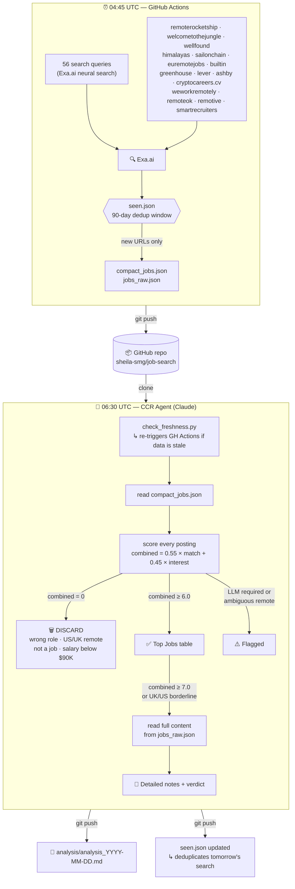

# Job Search Workflow — Sheila

## Overview

Every morning an automated pipeline searches the internet for relevant job postings, filters them, scores them, and produces a daily analysis document. The whole thing runs without manual intervention.

---

## Pipeline diagram



---

## Architecture

```
┌─────────────────────────────────────────────────────────────────┐
│                        GitHub Repo                              │
│              github.com/sheila-smg/job-search                   │
│                                                                 │
│  job_finder.py      ← search script                            │
│  check_freshness.py ← self-healing trigger                      │
│  compact_jobs.json  ← today's new postings (scored input)       │
│  jobs_raw.json      ← full content for detailed reads           │
│  seen.json          ← dedup history (90-day rolling window)     │
│  analysis/          ← one .md per day (the output you read)     │
└─────────────────────────────────────────────────────────────────┘
```

---

## Daily Timeline (UTC)

```
04:45 UTC  ──► GH Actions: run job_finder.py
               │
               │  Sends ~31 queries to Exa.ai neural search
               │  + 13 targeted queries against specific boards
               │  Deduplicates against seen.json
               │  Writes compact_jobs.json + jobs_raw.json
               │  Commits and pushes to GitHub
               ▼
06:30 UTC  ──► CCR Agent: daily analysis routine
               │
               │  Step 0: check_freshness.py — verifies data is
               │          fresh; triggers GH Actions if not
               │  Step 1: reads compact_jobs.json
               │  Step 2: scores each posting (snippet-based)
               │  Step 3: reads full content for ≥7.0 jobs
               │          and any UK/US borderline cases
               │  Step 4: writes analysis/analysis_YYYY-MM-DD.md
               │  Step 4b: commits + pushes the analysis file
               │  Step 5: updates seen.json
               │  Step 6: commits + pushes seen.json
               ▼
~06:45 UTC ──► analysis_YYYY-MM-DD.md available on GitHub
```

---

## Component 1 — Search (job_finder.py + GitHub Actions)

**What it does:** Queries Exa.ai's neural search with 56 queries total (40 general + 16 board-targeted, 20 results each — widened 2026-06-11), collects raw results, deduplicates against seen.json, and writes two files.

**Query types:**

| Category | Examples |
|----------|---------|
| Crypto/Web3 | "Senior DS remote crypto DeFi blockchain" |
| Risk & pricing ML | "Senior DS risk pricing models quantitative fully remote" |
| General senior remote | "Senior ML Engineer fully remote global" |
| EU-specific | "Senior MLE remote Europe EU" |
| Product/growth | "Senior DS product growth experimentation remote" |
| Recommendations | "Senior DS recommendation systems personalization remote" |
| Founding roles | "founding data scientist ML remote" |

**Domain queries (targeted job boards):**

| Board | Why |
|-------|-----|
| boards.greenhouse.io + jobs.lever.co | Startup roles, often missed by general index |
| remoterocketship.com | Curated remote roles, aggregates LinkedIn jobs |
| wellfound.com | Startup roles, globally remote |
| welcometothejungle.com | Strong EU coverage |
| sailonchain.com + cryptocareers.cv | Crypto/Web3 boards |
| himalayas.app | Fully-remote global roles |
| euremotejobs.com | EU-focused remote roles |

**Output — compact_jobs.json:**
```json
{
  "date": "2026-06-05",
  "total_new": 81,
  "pre_filtered": 78,
  "results": [
    { "title": "...", "url": "...", "published": "...", "snippet": "400 chars..." }
  ]
}
```

`total_new` = postings not in seen.json (genuinely new).
`pre_filtered` = total found before dedup.

---

## Component 2 — Scoring (CCR Agent)

The agent is a remote Claude session that runs in Anthropic's cloud. It reads the jobs and applies a scoring rubric.

### Scoring formula

```
combined = 0.55 × match + 0.45 × interest
```

**match (0–10):** How well Sheila's current skills satisfy the hard requirements.

**interest (0–10):** Technical challenge, production ML depth, IC autonomy, team quality, novel methods. Industry is never a negative — only technical domain mismatch (e.g. pure NLP with no transferable skills) lowers this score.

**Thresholds:**
- `combined ≥ 6.0` → appears in Top Jobs table
- `combined ≥ 7.0` → gets a detailed note with verdict

### DISCARD rules (score = 0, not scored)

| Rule | Reason |
|------|--------|
| Not a real job posting (article, profile, LinkedIn post) | Exa surfaces a lot of noise |
| On-site or hybrid required | Sheila is fully remote |
| Wrong role type (SWE, PM, analyst without modeling, actuarial, data engineer) | Role mismatch |
| Quant trader, market maker, AMM dev, protocol researcher (even in crypto) | Wrong role type — crypto sector doesn't compensate |
| "US Remote" / US states specified | No US work visa |
| "UK Remote" without explicit sponsorship or remote-from-EU | Post-Brexit requires visa |
| Country-specific auth required with no sponsorship path | e.g. "must have right to work in Singapore" |
| Salary explicitly below $90K USD | Hard floor |

**Exceptions to US/UK rule:** Keep if the posting explicitly mentions visa sponsorship, contractor/freelance open to international, or remote-from-EU acceptable.

### FLAG rules (kept, noted in a separate section)

| Flag | Meaning |
|------|---------|
| LLM/NLP hard required | Sheila has no LLM experience — may be worth tracking |
| Ambiguous remote (US/UK company + just says "Remote") | Need to verify before applying |

### Crypto/DeFi rule

Crypto sector is a **positive signal only when the core work is ML/DS modeling** (risk models, pricing, forecasting, fraud). Quant trader or AMM developer at a DeFi firm → DISCARD regardless of how interesting the sector sounds.

---

## Component 3 — Output

The agent writes `analysis/analysis_YYYY-MM-DD.md` with this structure:

```
# Job Search Analysis — YYYY-MM-DD
New postings: N | Qualified (≥6.0): N

## Top Jobs (≥6.0)
Table: Rank | Combined | Match | Interest | Role | Company | Sector | Remote | URL

## Detailed Notes (≥7.0)
Per-job: why it fits, gaps, requirements, remote policy, verdict

## Flagged: LLM/NLP or Ambiguous Remote
Table of borderline cases

## Discarded
Table: title | reason
```

---

## Self-healing

If the CCR agent runs and `compact_jobs.json` is stale or missing (e.g. GH Actions failed), `check_freshness.py` automatically triggers a new GH Actions run and waits for it to finish before continuing.

```
CCR Agent starts
    │
    ▼
check_freshness.py
    ├── compact_jobs.json has today's date? → continue
    └── stale or missing?
            │
            ▼
        trigger GH Actions via GitHub API
        wait up to 9 minutes for completion
        git pull origin main
            │
            ▼
        continue with fresh data
```

---

## Deduplication (seen.json)

Every URL the agent has ever processed is stored with its date. GH Actions compares new search results against seen.json before writing compact_jobs.json — so the agent only ever sees URLs it hasn't scored before.

Entries expire after **90 days**, so roles reappear if they're still open after 3 months.

---

## Manual operations

**Re-run the search with latest queries (from local machine):**
```python
python3 -c "
import check_freshness
check_freshness.trigger_and_wait(check_freshness.get_token())
"
```

**Log an application (removes company from future searches for 30 days):**
```bash
python job_finder.py --apply URL "Company" "Role"
```

**Skip a company without applying:**
```bash
python job_finder.py --skip "Company Name"
```

**Run the analysis manually:** trigger "Daily Job Analysis" from the GitHub Actions tab (workflow_dispatch), or run a local Claude Code session in this repo.

---

## ⚠️ Architecture change 2026-06-11

The 06:30 UTC claude.ai cloud routine (CCR) never ran reliably — every run hung
at container provisioning, and the replacement routine was auto-disabled by the
platform on 2026-06-10 (`config_rejected`). Both routines are disabled; see
BUG_REPORT_DRAFT.md.

The analysis step now runs as a second GitHub Actions workflow,
`.github/workflows/daily-analysis.yml`, chained via `workflow_run` to run
immediately after "Daily Job Search" completes. This also removes the
search/analysis race that check_freshness.py existed to self-heal (it remains
as a safety net). Requires the repo secret `CLAUDE_CODE_OAUTH_TOKEN`
(generate with `claude setup-token`).
